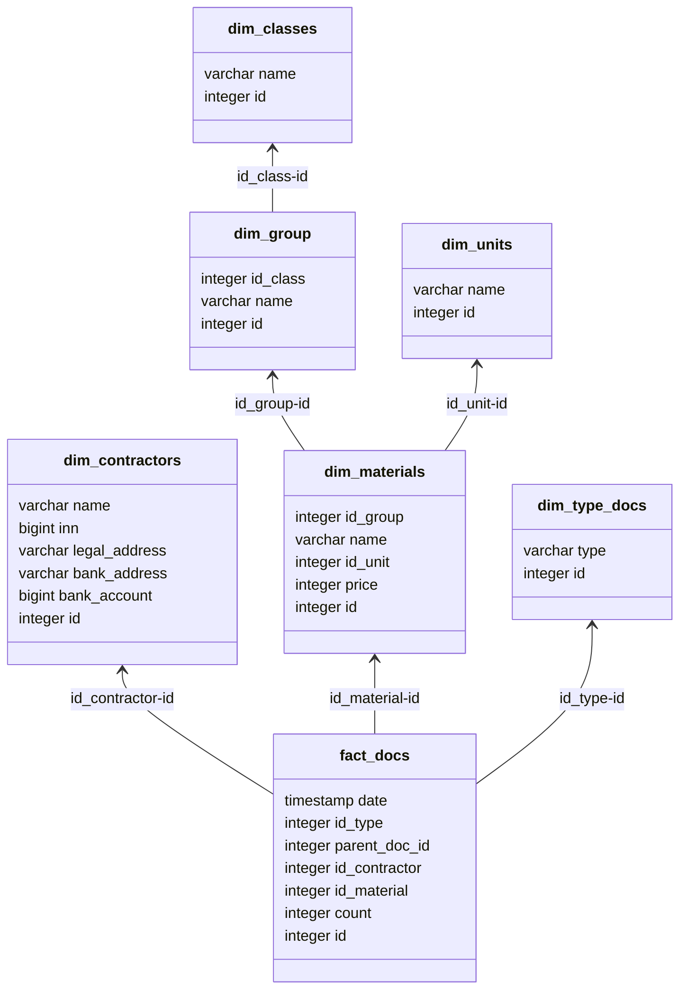

# Склад

## Концептуальная модель
```mermaid
classDiagram
direction BT
class dim_classes {
   Класс материалов
}
class dim_contractors {
   Поставщики
}
class dim_group {
   Группы материалов
}
class dim_materials {
   Материалы
}
class dim_type_docs {
   Типы документов
}
class dim_units {
   Единицы измерения
}
class fact_docs {
   Документы: приход, уход товара
}


dim_group  -->  dim_classes 
dim_materials  -->  dim_group : 
dim_materials  -->  dim_units : 
fact_docs  -->  dim_contractors : 
fact_docs  -->  dim_materials : 
fact_docs  -->  dim_type_docs : 

```
## Логическая модель

## Физическая модель
```sql
create table if not exists dim_units
(
    id   integer
        constraint dim_units_pk
            primary key autoincrement,
    name varchar not null
);

create unique index if not exists dim_units_id_uindex
    on dim_units (id);

create unique index if not exists dim_units_name_uindex
    on dim_units (name);


create table if not exists dim_type_docs
(
    id   integer
        constraint dim_type_docs_pk
            primary key autoincrement,
    type varchar not null
);

create unique index if not exists dim_type_docs_id_uindex
    on dim_type_docs (id);

create unique index if not exists dim_type_docs_type_uindex
    on dim_type_docs (type);

create table if not exists dim_classes
(
    id   integer
        constraint dim_classes_pk
            primary key autoincrement,
    name varchar not null
);

create unique index if not exists dim_classes_id_uindex
    on dim_classes (id);

create unique index if not exists dim_classes_name_uindex
    on dim_classes (name);

create table if not exists dim_group
(
    id       integer
        constraint dim_group_pk
            primary key autoincrement,
    id_class integer not null
        constraint dim_group_dim_classes_id_fk
            references dim_classes,
    name     varchar not null
);
create unique index if not exists dim_group_id_uindex
    on dim_group (id);
create table if not exists dim_materials
(
    id       integer
        constraint dim_materials_pk
            primary key autoincrement,
    id_group integer not null
        constraint dim_materials_dim_group_id_fk
            references dim_group,
    name     varchar not null,
    id_unit  integer not null
        constraint dim_materials_dim_units_id_fk
            references dim_units,
    price    integer
);
create unique index if not exists dim_materials_id_uindex
    on dim_materials (id);

create unique index if not exists dim_materials_name_uindex
    on dim_materials (name);

create table if not exists dim_contractors
(
    id            integer
        constraint dim_contractors_pk
            primary key autoincrement,
    name          varchar not null,
    inn           bigint  not null,
    legal_address varchar not null,
    bank_address  varchar not null,
    bank_account  bigint
);
create unique index if not exists dim_contractors_id_uindex
    on dim_contractors (id);

create unique index if not exists dim_contractors_inn_uindex
    on dim_contractors (inn);

create unique index if not exists dim_contractors_legal_address_uindex
    on dim_contractors (legal_address);

create unique index if not exists dim_contractors_name_uindex
    on dim_contractors (name);
create table if not exists fact_docs
(
    id            integer
        constraint fact_docs_pk
            primary key autoincrement,
    date          timestamp not null default current_timestamp,
    id_type       integer   not null
        constraint fact_docs_dim_type_docs_id_fk
            references dim_type_docs,
    parent_doc_id integer,
    id_contractor integer   not null
        constraint fact_docs_dim_contractors_id_fk
            references dim_contractors,
    id_material   integer   not null
        constraint fact_movement_dim_materials_id_fk
            references dim_materials,
    count         integer   not null
);
```